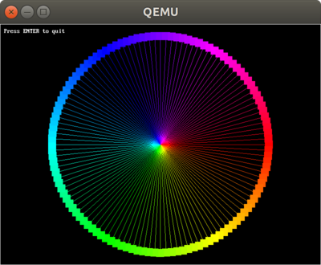
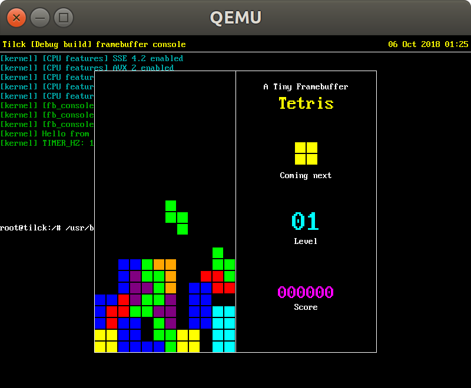

# Tfblib (Tiny Framebuffer Library)


[](https://vvaltchev.github.io/tfblib/tfblib_8h.html)
[](https://opensource.org/licenses/BSD-2-Clause)

`Tfblib` is a simple and low-level graphics library for drawing to the Linux
framebuffer. Currently, it is capable of drawing lines, rectangles and text.
It has support both for embedded (compiled-in) fonts in the library and
dynamically loaded `PSF` fonts at runtime. In addition to drawing functions,
`Tfblib` has a minimal support for keyboard input that allows simple
applications to put the TTY input in *raw mode* and read keystrokes. Both
blocking and non-blocking modes are supported.




Building
---------

Building `Tfblib` as a static library is simple as executing (in project's root
directory):

```
$ mkdir build
$ cd build
$ cmake ..
$ make
```
The `make` command will build the library along with the programs in the
examples/ directory. In case a release build (with optimizations) is desired,
the `cmake` command has to be run this way (assuming the current working
directory is the build directory):

    cmake -DCMAKE_BUILD_TYPE=Release ..

Or:

    cmake -DCMAKE_BUILD_TYPE=RelWithDebInfo ..

In case a release build with debug info is desired.

A "hello world" application
-----------------------------

Using `Tfblib` is extremely simple. Here below, there's an example about how
to initialize the library and draw a rectangle at the center of the screen.

```C
#include <stdio.h>
#include <tfblib/tfblib.h>
#include <tfblib/tfb_colors.h>

int main(int argc, char **argv)
{
   int rc;

   if ((rc = tfb_acquire_fb(0, NULL, NULL)) != TFB_SUCCESS) {
      fprintf(stderr, "tfb_acquire_fb() failed with error code: %d\n", rc);
      return 1;
   }

   uint32_t w = tfb_screen_width();
   uint32_t h = tfb_screen_height();
   uint32_t rect_w = w / 2;
   uint32_t rect_h = h / 2;

   /* Paint the whole screen in black */
   tfb_clear_screen(tfb_black);

   /* Draw some text on-screen */
   tfb_draw_string(10, 10, tfb_white, tfb_black, "Press ENTER to quit");

   /* Draw a red rectangle at the center of the screen */
   tfb_draw_rect(w / 2 - rect_w / 2,  /* x coordinate */
                 h / 2 - rect_h / 2,  /* y coordinate */
                 rect_w,              /* width */
                 rect_h,              /* height */
                 tfb_red              /* color */);

   getchar();
   tfb_release_fb();
   return 0;
}
```

Compatibility
--------------

`Tfblib` has been designed to work on the `Linux` kernel, on any hardware. It has
been tested on `x86` and on `ARM` machines (Raspberry Pi 3). It addition to that,
it works on [Tilck](https://github.com/vvaltchev/tilck), which is a small Linux
compatible kernel.



In order to compile `Tfblib` for `Tilck` is necessary to use a 32-bit x86
Linux `GCC` toolchian using `libmusl` and link everything statically. After
compiling this way, the examples will run both on Linux and on Tilck natively.
But, the **easiest way** to do that is just to use Tilck's build system.
Just drop a copy (or a symlink) of `Tfblib`'s main directory in the following
subdirectory of the `Tilck` project:

```
userapps/extra
```

Than just run:

```
$ ./scripts/cmake_run
```

And finally build Tilck with `make`. The `Tfblib` examples will be visible in
`/usr/bin/`, on Tilck.

Limitations
-------------

For the moment, the library supports only 32-bbp video modes.

Online API reference
----------------------

A pre-generated `doxygen` documentation is available at:
https://vvaltchev.github.io/tfblib/tfblib_8h.html


Generating the documentation locally
--------------------------------------

In order to generate the documentation locally, make sure you have `doxygen`
installed on your system and just run it in project's root directory.
The output html files will be placed in `<PROJECT_ROOT_DIR>/doxydocs/html`.
Just open `index.html` with your browser.

